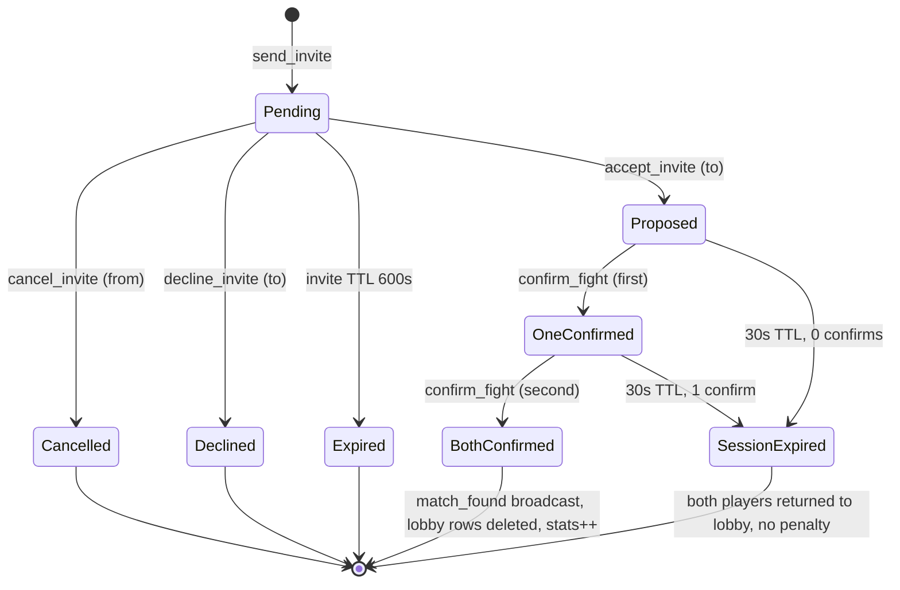
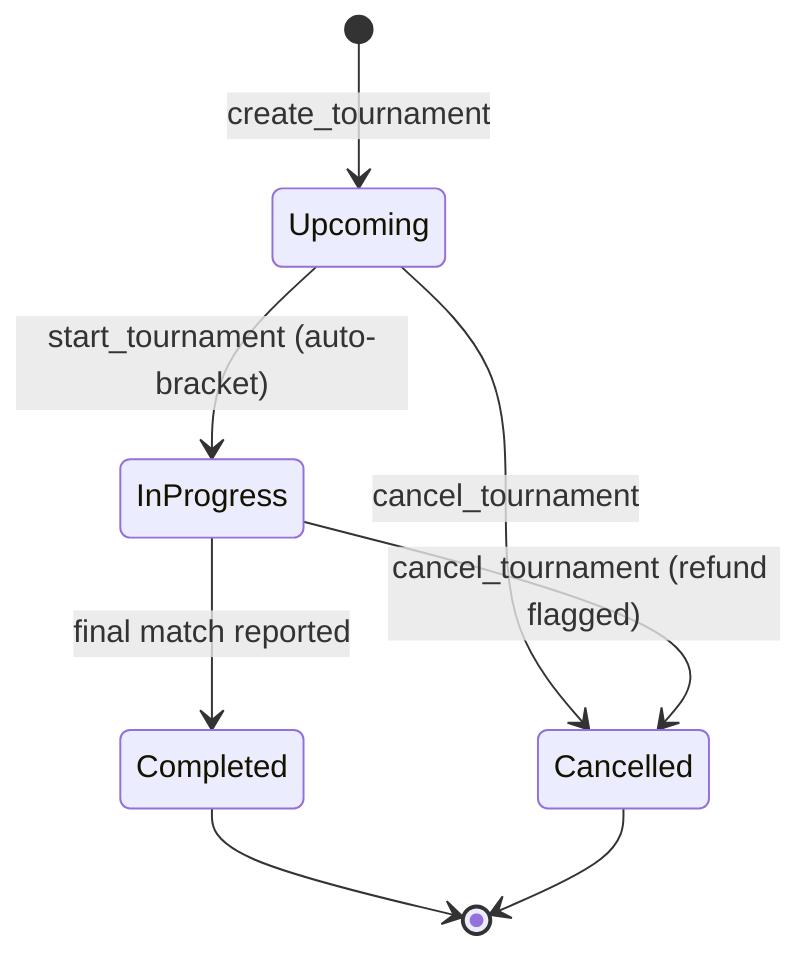

# Socket Transport · Lobby Matchmaking · Tournaments — Plugin + Backend Architecture

> **Phase 2 lobby protocol partially superseded by [`BACKEND_HANDOFF_LOBBY.md`](./BACKEND_HANDOFF_LOBBY.md)** (2026-05-14 design session). The handoff doc overrides this file for: build-type advertisement (Main/Zerker/Pure), per-style `ALLOWED_LOCATIONS_*` env split, server-resolved MeetAt world + meeting-place, `OSRS-LobbyMods` table for `is_mod` flag, current-MMR-not-peak rating (which obsoletes Phase 1.5 for the lobby), client-derived `pingedYou`, one-directional mutual-hide for blocks, drop of `sort_bucket` + invite `message`. **Read the handoff before implementing anything in Phase 2.**
>
> **Master plan.** This is the single source of truth for the new socket-based system. It covers, in order: socket transport + heartbeat replacement (Phase 1) → shard schema bump (Phase 1.5 — now lobby-optional, see handoff) → lobby matchmaking (Phase 2) → tournaments (Phase 4). Phases 2.5 (chat), 2.9 (parity gate), and 3 (heartbeat removal) are folded/deferred — see the per-phase markers below. Per-feature deep-dive docs (`LOBBY_SYSTEM.md`, `TOURNAMENT_SYSTEM.md`) get spawned as each phase lands.
>
> **Scope:** This document spans **both** repos. Plugin pieces live in `c:\Users\Owner\IdeaProjects\pvp-leaderboard\`. Backend pieces live in `C:\Users\Owner\OneDrive\Desktop\DevSecOpsWebsite\` (Lambda + Terraform + `backend/core/*`). All paths in this doc are absolute on purpose so it's copy-pasteable across both workspaces.
>
> **Mirrored to backend repo** at [`OSRS-MMR/docs/SOCKET_LOBBY_ARCHITECTURE.md`](C:\Users\Owner\OneDrive\Desktop\DevSecOpsWebsite\OSRS-MMR\docs\SOCKET_LOBBY_ARCHITECTURE.md). The plugin-repo copy is canonical; backend copy is regenerated when this one changes (see PLUGIN_PROGRESS.md / BACKEND_PROGRESS.md update protocol).
>
> **Progress trackers:**
> - Plugin: [`docs/PLUGIN_PROGRESS.md`](c:\Users\Owner\IdeaProjects\pvp-leaderboard\docs\PLUGIN_PROGRESS.md) — updated **every time anything in `c:\Users\Owner\IdeaProjects\pvp-leaderboard\src\**` changes for this plan.**
> - Backend: [`OSRS-MMR/docs/BACKEND_PROGRESS.md`](C:\Users\Owner\OneDrive\Desktop\DevSecOpsWebsite\OSRS-MMR\docs\BACKEND_PROGRESS.md) — updated **every time anything in `C:\Users\Owner\OneDrive\Desktop\DevSecOpsWebsite\{backend,OSRS-MMR,docs}\**` changes for this plan.**
>
> **Supersedes** Phase 2 ("anonymous queue") of [`OSRS-MMR/docs/WEBSOCKET_MATCHMAKING_PLAN.md`](C:\Users\Owner\OneDrive\Desktop\DevSecOpsWebsite\OSRS-MMR\docs\WEBSOCKET_MATCHMAKING_PLAN.md). That document will be rewritten in Phase 2 of this plan to reflect the lobby UX.

## Hard Precondition

Domain migration ([`TODO.md` §19](C:\Users\Owner\OneDrive\Desktop\DevSecOpsWebsite\TODO.md)) MUST be complete AND **every URL path is byte-identical between old and new domain**. Old domain redirects to the same path on the new domain — no path changes.

**Autobanner parity required for `pvp-leaderboard.com`** (every allow/limit currently keyed to `devsecopsautomated.com` is reproduced for the new domain; see [`AUTOBANNER.md`](C:\Users\Owner\OneDrive\Desktop\DevSecOpsWebsite\OSRS-MMR\docs\AUTOBANNER.md)):

- `OSRS-MMR/lambda_code/realtime_ban.py` URI allowlist — every `^/rank_idx/...`, `/leaderboard.json`, static-asset, `/auth/callback.html` pattern must match traffic arriving via `pvp-leaderboard.com` (CloudFront `Host` header), not just the legacy domain.
- `OSRS-MMR/lambda_code/website_rate_limiter.py` — `Referer`/`Origin` substring check `devsecopsautomated.com` is **augmented** with `pvp-leaderboard.com` (both during dual-running; only the new one after final cutover, per `TODO.md §19` step 3).
- `OSRS-MMR/lambda_code/endpoints/user.py` and `endpoints/matches.py` — same `Referer`/`Origin` augmentation.
- `OSRS-MMR/lambda_code/api_realtime_ban.py` — website-endpoint exemption list (`/search`, `/user`, `/matches`, `/distribution`, `/percentiles`, `/click`, `/rank`) reads from the new `Host`/`Referer` correctly.
- WAF rules in [`waf.tf`](C:\Users\Owner\OneDrive\Desktop\DevSecOpsWebsite\OSRS-MMR\waf.tf) and [`waf_api.tf`](C:\Users\Owner\OneDrive\Desktop\DevSecOpsWebsite\OSRS-MMR\waf_api.tf): `OSRS-Whitelisted-IPs(-Regional)`, `AllowMatchSubmitForLogging`, `AllowHeartbeatForWhitelist`, `BlockBannedIPs` — verified to behave identically when the request's CloudFront distribution is the `pvp-leaderboard.com` one. ACM cert SANs include both domains during dual-running.
- WebSocket endpoint added as `wss://api.pvp-leaderboard.com/ws/prod` (custom domain) — never as `api.devsecopsautomated.com`. New API Gateway gets its own WAF WebACL referencing the **same** `OSRS-Auto-Banned-IPs-Regional` IP set so a banned IP can't connect to the socket.
- E2E tests in `tests/e2e/` that hit `devsecopsautomated.com` are duplicated against `pvp-leaderboard.com`. Spec files retain dual-domain coverage until cutover.

WebSocket endpoint is hosted at `wss://api.pvp-leaderboard.com/ws/prod` with a separate dev URL on the staging domain.

## Decisions (locked)

- **Socket identity is mandatory and game-state-gated.** Every WebSocket connection MUST carry `?uuid={UUID}` plus a `RuneLite/<ver>` `User-Agent` at `$connect`. Missing, malformed, or non-RuneLite values → **stealth-200 reject + WAF auto-ban + (when UUID is format-valid) UUID ban in `OSRS-BanList`** — exact mirror of [`invalid_heartbeat_ban.py`](C:\Users\Owner\OneDrive\Desktop\DevSecOpsWebsite\OSRS-MMR\lambda_code\invalid_heartbeat_ban.py). No anonymous sockets, ever. There is no other way to obtain a connection.
- **Socket lifecycle is `GameState.LOGGED_IN` ↔ `LOGIN_SCREEN`** (mirrors current heartbeat wiring at [`PvPLeaderboardPlugin.onGameStateChanged`](c:\Users\Owner\IdeaProjects\pvp-leaderboard\src\main\java\com\pvp\leaderboard\PvPLeaderboardPlugin.java)). Plugin running but player not in-game → no connection. Player logs in → socket opens. Logout/login screen → socket closes. **60-second server-side grace window**: on `$disconnect` the row is marked `disconnected_at=now`, `expires_at=now+60s` (TTL) instead of being deleted immediately. Brief world-hop reconnects do not cause a match-submit gap.
- **Spoof-match protection is socket-only.** [`heartbeat_auth_check.py`](C:\Users\Owner\OneDrive\Desktop\DevSecOpsWebsite\OSRS-MMR\lambda_code\heartbeat_auth_check.py) is **renamed `connection_auth_check.py` in P1** (not Phase 3 — there is no Phase 3 any more) and reads only `OSRS-Connections` (open OR within 60s grace). No fallback to `OSRS-Heartbeats`; that table is deleted at P1 GA. **Fail-open on DDB outage** preserved (matches today's contract: an outage on the auth-check table does not silently ban every UUID). `OSRS-Whitelist` UUID bypass and dynamic IP whitelist bypass paths are preserved unchanged.
- **Lobby UX, not queue.** Visible roster sorted by chosen-bucket peak rating, per-person `Fight` button → style picker (NH/Veng/Multi/DMM) → location picker (PvP Arena/FFA Portal/Wildy/Other) → invite. Accepted invites trigger a 30-second mutual-confirm phase on both sides; once both confirm, both players land on a terminal "Meet at" view (world + meeting place per style) with a "Find a new match" exit back to the lobby. **No chat in this release** (see chat-deferred decision below).
- **Persistent membership.** Players auto-rejoin the lobby on every login until they explicitly click `Exit Lobby`. First-time enable is opt-in via the `Join Lobby` button.
- **Sort by display rank, gate by display rank.** Min/max are display-rank enums (`Bronze 3` … `3rd Age`), not numeric tier offsets. Roster greys out names whose chosen-bucket peak rank is outside *either* party's min/max.
- **Bucket selector for sort.** NH default; toggleable to Veng/Multi/DMM/Overall. Selection drives both the sort key and the displayed peak rating per row.
- **Peak rating sourced from shards** (`rank_idx/{bucket}/{prefix}.json`). Shards already cache 1 hour at CloudFront. **Schema bump required:** add `peak_mmr` per bucket to the shard payload (the writer already has access to peak — see [`account_merge.recalculate_peaks_from_matchlogs`](C:\Users\Owner\OneDrive\Desktop\DevSecOpsWebsite\backend\core\account_merge.py)).
- **Tachyon-style JSON over AWS API Gateway WebSocket.** One UUID = one connection. 4 KB max msg, 12 msg/min/connection, command allowlist on both sides.
- **Block list blocks invites only.** Mutual hide: blocker doesn't see blocked user in the roster; blocked user can still see the blocker (so the blocker doesn't tip their hand) but cannot send invites to them. Chat is out of scope (see chat-deferred below).
- **All backend DB-mutating logic lives in `backend.core.*`** (per user rule) — `backend/core/connections.py`, `backend/core/lobby.py`, `backend/core/socket_protocol.py`. Lambda handlers orchestrate; core mutates.
- **TDD with whitelist-first then blacklist** for every new module (per user rule).
- **Heartbeat is replaced, not dual-run.** The socket system **is** the new auth + presence + whitelist source from P1 GA. There is no parity gate, no divergence alarm, no dual-source `whitelist_generator.py`, no `OSRS-Heartbeats` fallback in `connection_auth_check.py`. Safety net during P1 rollout is **beta-UUID gating**: non-beta UUIDs continue to use heartbeat (current behavior) while beta UUIDs ride the socket only; at P1 GA the gate flips global → socket-only and the same change deletes `OSRS-Heartbeats` table + `heartbeat_handler.py` + `WhitelistService.sendHeartbeat`/`scheduleHeartbeat`/`cancelScheduledHeartbeat` + heartbeat WAF rules + heartbeat dashboard widgets. (The former Phase 3 is collapsed into the end of Phase 1.)
- **Chat is indefinitely deferred (not in this release).** The lobby ships **without** a chat panel, without Discord sync, without per-match chat, without moderation/mute, and without tournament announcement rooms. All of the following are out of scope: `LobbyChatPanel`, `MatchChatPanel`, `LobbyChatService`, `lobby_chat.py`, `lobby_moderation.py`, `lobby_chat_handler.py`, the Fargate Discord bot, `OSRS-LobbyModerators`, `OSRS-LobbyChatLog`, the `lobby_mute` ban_type, the `POST /lobby/inbound` HTTP route, the `LOBBY_MUTED` / `NOT_IN_LOBBY` / `INVALID_ROOM` / `INVALID_HMAC` / `MOD_REQUIRED` error codes, and the corresponding lobby-chat SSM params. The post-acceptance "Meet at" view (world + meeting place + Find-a-new-match) is the terminal state; players coordinate verbally / via in-game chat from there. Chat will land as a separate post-release feature with its own design pass — see [`PLUGIN_PROGRESS.md` `chat-deferred`](c:\Users\Owner\IdeaProjects\pvp-leaderboard\docs\PLUGIN_PROGRESS.md).
- **Tournaments are a Phase 4 feature** — gated entirely on Phase 2 lobby acceptance. Until P4 lands, the Tournaments sub-tab is greyed and flashes "Coming soon, check Discord" (current plugin + mock parity).
- **Tournament identity = lobby identity.** Same UUID, same socket. No separate signup flow. Joining a tournament is a single `tournament/register` cmd over the existing socket.
- **Tournament admin is a separate role from lobby moderator.** Lobby mods CAN'T run tournaments unless their UUID is also in `OSRS-TournamentAdmins`. Two-table separation prevents IAM scope creep.
- **Bracket types day-one: Single Elim + Round Robin.** Double Elim and Swiss land in P4.5 if there's demand. Bracket-generation logic lives in `backend/core/tournament_brackets.py` and is bracket-type-agnostic via a strategy pattern.
- **Anti-smurf in tournaments uses peak rating snapshot at registration.** [`backend/core/account_merge.recalculate_peaks_from_matchlogs`](C:\Users\Owner\OneDrive\Desktop\DevSecOpsWebsite\backend\core\account_merge.py) is called for every registrant to refresh peak data before snapshot. Bracket seeding uses snapshot, not live peak. New computer? Admin manually adjusts MMR before registration cutoff per the lobby's "Smurfing in tournaments" rule (rule list now lives in the Java [`MatchmakingLobbyPanel`](c:\Users\Owner\IdeaProjects\pvp-leaderboard\src\main\java\com\pvp\leaderboard\ui\MatchmakingLobbyPanel.java) rather than the retired HTML mock).
- **Buy-ins are manual-verify only (P4 day-one).** A registrant declares an intent-to-pay; admin marks `paid=true` after confirming GP transfer in-game. Automated buy-ins (in-game escrow trade integration) are explicitly out of scope until further notice — bought/botted gold rule from the lobby Rules tab applies.
- **Tournament matches reuse the existing lobby invite + match-room flow.** `tournament/start_round` creates one `OSRS-LobbyInvites` row per pairing with `tournament_id` and `bracket_match_id` attributes; the existing `accept_invite` flow takes over from there. Result-reporting is auto from `/matchresult` submissions when both players' UUIDs match the bracket pair, fallback to manual admin advance.
- **No tournament chat in this release.** Per the chat-deferred decision above, `tournament:<id>` announcement rooms, `tournament_match:<id>` per-match chat, and the Discord webhook for bracket announcements are all out of scope. Bracket state is conveyed entirely through the plugin's `BracketView` + `tournament/*` push events. Tournament chat lands with the post-release chat feature.

## High-level Flow

```mermaid
flowchart LR
  Plugin[RuneLite Plugin] -->|wss connect ?uuid=...| APIGW[API Gateway WebSocket]
  APIGW -->|connect/disconnect/default| WSL[websocket_handler.py]
  WSL -->|cmd routing| LBL[lobby_handler.py]
  WSL -->|put/delete| Conn[OSRS-Connections]
  LBL -->|put/delete/query| LM[OSRS-LobbyMembers]
  LBL -->|put/delete/query| LI[OSRS-LobbyInvites]
  LBL -->|get| LB[OSRS-LobbyBlocks]
  APIGW -.push.-> Plugin
  Plugin -->|POST /matchresult \(unchanged\)| MR[match_handler.post_mmr]
  MR -->|auth check| AC[connection_auth_check.py]
  AC -->|GetItem| Conn
  ShardWriter[leaderboard_cache_writer.py] -->|writes peak_mmr per bucket| Shards[(rank_idx/&#123;bucket&#125;/*.json)]
  Plugin -->|GET roster enrichment| Shards
```

---

## Phase 1 — Socket Transport + Presence + Heartbeat Replacement

> **Phase 1 is the heartbeat replacement.** There is no separate "Phase 3 — heartbeat removal" any more; the table, handler, WAF rules, and plugin code that used to live in heartbeat are all deleted at the end of Phase 1, gated only by the beta-UUID rollout window. There is no parity gate, no divergence alarm, no dual-source whitelist generator. The socket **is** the new system.

### Plugin (Java)

New package: `com.pvp.leaderboard.service.socket`

- `WebSocketManager` (`@Singleton`) — opens one OkHttp `WebSocket` to `wss://api.pvp-leaderboard.com/ws/prod?uuid={UUID}` with `User-Agent: RuneLite/<ver>` (set via OkHttp `Request.Builder.header`). UUID is **mandatory**: if `clientIdentityService.getClientUniqueId()` returns null/empty, do NOT attempt to connect (log + bail). Reconnects with exponential backoff (1, 2, 4, 8, 16, 32, 60s cap). Closes on `shutDown` and on game logout.
- `SocketProtocol` — `ALLOWED_OUTGOING = {"system/ping", "lobby/join", "lobby/leave", "lobby/invite", "lobby/cancel_invite", "lobby/accept", "lobby/decline", "lobby/confirm", "lobby/block", "lobby/unblock"}`. Tournament cmds get appended at P4. Chat cmds are **not** in this release. Anything else throws on send.
- `SocketCommand` POJO + Gson serialization: `{"cmd": "...", "data": {...}}`.
- `SocketEventBus` — listener registry keyed by `cmd`, dispatched off the socket thread via the existing `ScheduledExecutorService`.
- `PresenceListener` — handles `presence/count`, posts to `DashboardPanel` for "X players online".
- 8-minute scheduled `system/ping` to defeat API Gateway's 10-min idle timeout.

Lifecycle wiring (replaces existing heartbeat wiring; same `GameState` events used today by [`WhitelistService.onLogin`/`onLogout`](c:\Users\Owner\IdeaProjects\pvp-leaderboard\src\main\java\com\pvp\leaderboard\service\WhitelistService.java) and [`PvPLeaderboardPlugin.onGameStateChanged`](c:\Users\Owner\IdeaProjects\pvp-leaderboard\src\main\java\com\pvp\leaderboard\PvPLeaderboardPlugin.java)):
- `GameState.LOGGED_IN` (after the existing 10-tick player-ready delay) → `webSocketManager.connect(uuid)`.
- `GameState.LOGIN_SCREEN` → `webSocketManager.disconnect(GOING_AWAY)`.
- `GameState.HOPPING` / `LOADING` → leave the socket open; the API Gateway 10-min idle timeout is well within a world hop. Reconnect logic handles a torn TCP if the hop drops the connection.
- `startUp()` resume: if game is already `LOGGED_IN` when plugin enables (e.g. `/runelite plugins` toggle), connect immediately — same shape as the existing `whitelistService.onLogin` resume at [`PvPLeaderboardPlugin.startUp` lines 147–158](c:\Users\Owner\IdeaProjects\pvp-leaderboard\src\main\java\com\pvp\leaderboard\PvPLeaderboardPlugin.java).

**Heartbeat-replacement plugin work (P1 GA, single change):**
- `WhitelistService` is renamed `WhitelistFetchService`. Only the `whitelist.json` poll remains; the heartbeat-mixing principle violation (called out in existing code as a `// TODO`) is resolved as part of the rename.
- `WhitelistService.sendHeartbeat()`, `scheduleHeartbeat()`, `cancelScheduledHeartbeat()`, and all `OkHttp` calls to `/heartbeat` are deleted.
- During the beta window only (gated by `enableSocket=true` config that's flipped per-UUID via a beta list), the socket runs and heartbeat does **not** for those UUIDs. Non-beta UUIDs still use heartbeat (current behavior, no plugin changes) until the GA flip.
- At P1 GA the gate flips global, the heartbeat branch is deleted entirely, and the same plugin release ships without heartbeat code.

Tests (TDD):
- `WebSocketManagerTest` — connect, reconnect-with-backoff, ping schedule, send-rejects-non-allowlisted, shutdown closes cleanly.
- `SocketProtocolTest` — encode/decode round-trip, reject unknown cmd, reject oversized payload (4 KB).
- `WhitelistFetchServiceTest` (post-rename) — `whitelist.json` poll still works, no heartbeat code paths reachable.

### Backend (Python + Terraform)

New files:
- `OSRS-MMR/websocket.tf` — `aws_apigatewayv2_api` (WebSocket, `route_selection_expression = "$request.body.cmd"`), `$connect`/`$disconnect`/`$default` routes, integration → Lambda, `prod` stage, WAF reuse (`OSRS-Auto-Banned-IPs-Regional` + `OSRS-Whitelisted-IPs-Regional` + new `RateLimitWebSocketConnects` rule mirroring `RateLimitHeartbeats`), custom domain `api.pvp-leaderboard.com` for `/ws/*`.
- `OSRS-MMR/lambda_code/websocket_handler.py` — orchestrator only. `handle_connect` / `handle_disconnect` / `handle_default` delegate everything mutating to `backend.core.connections`, `backend.core.socket_protocol`, and `backend.core.invalid_connect_ban`.
- `backend/core/connections.py` — `register_connection`, `mark_disconnected_with_grace` (sets `disconnected_at=now`, `expires_at=now+60s`, NOT a delete), `purge_expired`, `get_connection_by_uuid` (returns rows where `disconnected_at` is null OR within grace), `force_close_duplicate`, `cleanup_stale_on_gone`, `count_active_connections` (filters out grace-only rows for the public count).
- `backend/core/socket_protocol.py` — pure functions: `validate_cmd(cmd, allowlist)`, `validate_size(body, max_bytes)`, `consume_rate_limit(connection_id, now)`, `error_envelope(code, message)`. No I/O.
- `backend/core/invalid_connect_ban.py` — **mirror of `invalid_heartbeat_ban.py`** for the WebSocket. `handle_invalid_connect(ip, reason_code, invalid_value, client_uuid, user_agent)` returns the stealth `$connect` reject response (HTTP 200 from Lambda authorizer that resolves to a refused upgrade, exact body shape TBD per API Gateway WebSocket conventions) AND best-effort:
  - WAF-bans the source IP (CloudFront + Regional auto-banned IP sets), reusing the existing `add_ip_to_waf_ban_list` retry helper.
  - When `client_uuid` is a valid v4: `backend.core.banning.add_ban("uuid", client_uuid, reason="INVALID_CONNECT:<reason_code>", banned_by="LAMBDA_CONNECT_VALIDATION", skip_existing=True)`.
  - When `client_uuid` is malformed: skip UUID ban (prevents `ban_key` pollution, mirrors heartbeat behavior).
  - Audit row to `OSRS-Website-BanHistory` with `ban_source=LAMBDA_CONNECT_VALIDATION`.
  - Reason codes: `missing_uuid`, `invalid_uuid_format`, `missing_user_agent`, `invalid_user_agent`, `missing_connection_id`.

`$connect` validation order (short-circuits on first failure, every failure routes through `invalid_connect_ban.handle_invalid_connect`):
1. UUID present in query string → else `missing_uuid`
2. UUID matches v4 format (`backend.core.validation.is_valid_uuid_format`) → else `invalid_uuid_format`
3. User-Agent present → else `missing_user_agent`
4. User-Agent passes `backend.core.validation.is_valid_runelite_user_agent` → else `invalid_user_agent`
5. WAF-banned IP check (via `waf_ban_check.is_waf_banned`), unless IP whitelisted → else stealth refuse
6. UUID-banned check (`backend.core.banning.check_ban("uuid", client_uuid)`) → else stealth refuse
7. `OSRS-Whitelist` UUID bypass for trusted-but-rate-limited path (parity with `heartbeat_auth_check`)
8. Resolve `peak_per_bucket` snapshot from `OSRS-MMR-table` (`get_item` only)
9. Force-close any prior connection holding the same UUID (one-UUID-one-connection, mirrors heartbeat single-row-per-UUID)
10. `register_connection(connectionId, uuid, source_ip, peak_per_bucket, player_names, expires_at=now+2.5h, disconnected_at=null)`
11. Broadcast updated `presence/count`

`$disconnect` flow:
- `mark_disconnected_with_grace(connection_id)` — sets `disconnected_at=now`, `expires_at=now+60s` (TTL handles physical delete). Does **not** broadcast a count change immediately; `count_active_connections` filters grace-only rows so the count reflects "currently connected" but the row remains queryable for spoof-match auth during the window.

New DynamoDB table:
- `OSRS-Connections` — PK `connectionId`, GSI `uuid-index`, GSI `last_message_at-index` (sparse, for rate-limit + idle scans), attrs: `uuid`, `player_names`, `connected_at`, `source_ip`, `last_ping`, `last_message_at`, `peak_per_bucket` (Map), `disconnected_at` (null while open), `expires_at` (TTL).

IAM (least-priv): WebSocket Lambda gets `Put/Update/Delete/Get/Query/Scan` on `OSRS-Connections` + both GSIs, **`GetItem` only** on `OSRS-MMR-table` (for peak snapshot + player_names lookup, parity with the legacy `heartbeat_handler`), `wafv2:GetIPSet`/`UpdateIPSet` on the two `OSRS-Auto-Banned-IPs*` sets (parity with `invalid_heartbeat_ban`), `Put/Get/Query` on `OSRS-BanList` + `Put` on `OSRS-Website-BanHistory` (scoped via `dynamodb:LeadingKeys` to `uuid:*`), `execute-api:ManageConnections` on the WS API ARN, CloudWatch logs. Nothing else.

**Heartbeat-replacement backend work (single P1 GA change, no dual-running):**
1. **`connection_auth_check.py`** — new file (or rename of `heartbeat_auth_check.py`). Reads only `OSRS-Connections` (open OR within 60s grace). Fail-open on DDB outage preserved. `OSRS-Whitelist` UUID bypass + dynamic IP whitelist bypass preserved. `match_handler.post_mmr` and any other current consumer of `heartbeat_auth_check` flips to this in the same change.
2. **`whitelist_generator.py`** — reads only `OSRS-Connections` (filter `disconnected_at IS NULL`). `source_ip` for dynamic WAF whitelist comes from the connection row. `OSRS-Heartbeats` import + scan deleted.
3. **`connection_counter.py`** — replaces `heartbeat_counter.py`. Emits `OSRS/Connections/ActiveCount` only (no `OSRS/Heartbeats/ActiveCount`). All dashboards that read the old metric are repointed in the same change.
4. **Heartbeat deletion** — same change deletes: `OSRS-Heartbeats` table, `heartbeat_handler.py`, `heartbeat_counter.py` (and `.tf`), `RateLimitHeartbeats` + `AllowHeartbeatForWhitelist` WAF rules in `waf_api.tf`, heartbeat metric filter + volume alarm in `whitelist_infra.tf`, heartbeat dashboard widgets in `monitoring_daily_submissions.tf` + `monitoring_api.tf`, and the `heartbeat_auth_check.py` / `invalid_heartbeat_ban.py` archives.
5. **`OSRS-Whitelist` UUID bypass parity** — `$connect` consults `OSRS-Whitelist` exactly as `heartbeat_auth_check` does today. Fail-closed on outage.
6. **`uuid_alias.resolve_canonical_uuid` parity** — `$connect` runs the resolver immediately after UUID-format/UA checks (mirrors `heartbeat_handler.post_heartbeat`). Aliased UUIDs canonicalize before storage.
7. **`player_names` snapshot parity** — `$connect` reads `OSRS-MMR-table[uuid].player_names` and stores on the connection row, so `whitelist_generator.py` can enrich rank info (mirrors the legacy heartbeat behavior). 

Tests (TDD, in `tests/unit/core/` and `tests/unit/`):
- `test_socket_protocol.py` — **whitelist** (encode/decode, allowlisted cmd accepted, valid size, rate-limit token granted) **then blacklist** (unknown cmd, oversized, malformed JSON, missing `cmd`, rate-limit exhausted, server-only cmds rejected).
- `test_connections.py` — **whitelist** (register, mark-disconnect-with-grace, get-by-uuid finds open AND in-grace, count_active excludes in-grace, dedupe-by-uuid closes old) **then blacklist** (mark-disconnect on missing row idempotent, GoneException → cleanup, fail-closed on whitelist-table outage).
- `test_invalid_connect_ban.py` — **whitelist** (each reason code triggers WAF write + (when valid v4) UUID ban + history audit row; valid `$connect` writes nothing) **then blacklist** (malformed UUID does NOT pollute ban_key, missing IP skips WAF write but still UUID-bans, WAF write retries on optimistic-lock).
- `test_websocket_handler.py` — full 12 whitelist + 11 blacklist matrix from the existing master plan, **plus**: `test_connect_missing_uuid_bans_ip`, `test_connect_invalid_uuid_format_bans_ip_only_not_uuid`, `test_connect_invalid_user_agent_bans_ip_and_uuid`, `test_disconnect_keeps_row_in_grace`, `test_grace_row_satisfies_spoof_match_check`, `test_grace_row_excluded_from_presence_count`.
- `test_connection_auth_check.py` — **whitelist** (open row → authorized, in-grace row → authorized, `OSRS-Whitelist` UUID → authorized, IP-whitelisted UUID → authorized, fail-open on DDB outage) **then blacklist** (no row + no whitelist + no IP-whitelist → spoof reject, expired-past-grace row → reject, banned UUID short-circuits before lookup).
- `test_whitelist_generator.py` — `OSRS-Connections`-only scan, `source_ip` pulled from connection row, grace rows excluded.
- `tests/e2e/socket-stealth.spec.js` — sibling of the legacy `heartbeat-stealth.spec.js`: missing UUID / invalid UUID / invalid UA / banned IP all return the stealth refuse and trigger WAF + UUID-ban side effects.
- `tests/e2e/spoof-match-no-socket.spec.js` — a spoofed `/matchresult` from a UUID with no open socket and no grace row is dropped + WAF-banned (was previously gated by heartbeat). Verifies no regression after heartbeat deletion.

### Phase 1 Done When
- Plugin `WebSocketManager` connects + reconnects in production for **1–2 weeks under beta-UUID gating only**; beta UUIDs ride the socket and have their heartbeat path disabled; non-beta UUIDs continue on heartbeat unchanged.
- `connection_auth_check.py` is the spoof-match auth path for beta UUIDs (heartbeat path for non-beta).
- Beta blue-team test: a banned/missing-socket UUID's `/matchresult` is dropped + WAF-banned; a whitelisted UUID's is accepted. Same expectation under the new code path.
- At GA flip: heartbeat plugin code, `OSRS-Heartbeats` table, `heartbeat_handler.py`, `heartbeat_counter.py`, heartbeat WAF rules, and heartbeat dashboard widgets are all deleted in **one** change. After GA, `rg heartbeat` returns only historical references in changelog/incident logs.

---

## Phase 1.5 — Shard Schema Bump (peak rating per bucket)

The lobby sorts and gates by **peak** rating per bucket. Shards already cache per-bucket `mmr` and `tier`, but not `peak_mmr`. This phase bumps the shard schema and the writer **before** any lobby code consumes it.

### Backend
- [`OSRS-MMR/lambda_code/leaderboard_cache_writer.py`](C:\Users\Owner\OneDrive\Desktop\DevSecOpsWebsite\OSRS-MMR\lambda_code\leaderboard_cache_writer.py) — when streaming the `OSRS-Leaderboard` GSI rows, also project the per-bucket `peak_mu` (write `peak_mmr` and `peak_tier`/`peak_rank`/`peak_division` into both `account_rank_info_map[acct_sha]` and `name_rank_info_map[canon_name]`). Source is the existing peak fields on `OSRS-MMR-table` (set by [`backend/core/account_merge.recalculate_peaks_from_matchlogs`](C:\Users\Owner\OneDrive\Desktop\DevSecOpsWebsite\backend\core\account_merge.py)).
- Backfill: invoke writer with `force_full=true` for all 5 buckets after the schema change deploys; verify against `insights_diff.py` drift.
- [`OSRS-MMR/docs/SHARDS.md`](C:\Users\Owner\OneDrive\Desktop\DevSecOpsWebsite\OSRS-MMR\docs\SHARDS.md) — update the JSON schema table to add `peak_mmr`, `peak_tier`, `peak_rank`, `peak_division`. **Backward-compatible**: missing `peak_*` on legacy entries treated as "no peak data" by readers (lobby still allows them in but cannot use them for sort/gate — falls back to current `mmr`).

### Plugin
- New cache: `com.pvp.leaderboard.cache.PeakRankCache` (mirrors existing [`WorldRankCache`](c:\Users\Owner\IdeaProjects\pvp-leaderboard\src\main\java\com\pvp\leaderboard\cache\WorldRankCache.java)) — per-`acct_sha`, per-bucket peak, 1-hour TTL aligned with CloudFront cache.
- New service: `com.pvp.leaderboard.service.ShardPeakLookupService` — given a list of `acct_sha` and a bucket, batches shard-prefix GETs (one per unique 2-char prefix) and populates `PeakRankCache`. Used by `LobbyRoster` to enrich roster rows on receipt.

### Tests (TDD)
- `tests/unit/lambda_code/test_leaderboard_cache_writer.py` — **whitelist** (peak fields written for both maps, all 5 buckets) **then blacklist** (missing peak on a row → field omitted, not errored; legacy shard merge preserves old entries without peak).
- `tests/e2e/s3-structure.spec.js` — extend existing schema validator to assert optional `peak_mmr` shape.
- Plugin: `ShardPeakLookupServiceTest` — batched fetch dedupes prefixes, 1-hour cache hit on second lookup, missing-peak falls back to `mmr`.

### Phase 1.5 Done When
- All 5 buckets have `peak_mmr` populated for ≥99% of accounts.
- Plugin can resolve a 50-row roster's peak ratings in ≤3 shard GETs (prefix dedup verified).

---

## Phase 2 — Lobby (NEW, replaces master plan's queue model)

### Plugin (Java)

New package: `com.pvp.leaderboard.lobby`

- `LobbyService` (`@Singleton`) — orchestrates `joinLobby`, `leaveLobby`, `sendInvite`, `cancelInvite`, `acceptInvite`, `declineInvite`, `confirmFight`, `block`, `unblock`. Dispatches socket commands via `WebSocketManager.send(SocketCommand)`. Re-issues `lobby/join` on every socket reconnect when "Exit Lobby" has not been clicked (persistent membership).
- `LobbyRoster` — local cache of `LobbyMember{uuid, name, peakRankByBucket:Map<RankBucket,DisplayRank>, region, pingedYou:boolean, pingExpiresAtEpochSec, blockedByMe:boolean}`. Server is source of truth; client only renders. Enriched by `ShardPeakLookupService` for `peakRankByBucket` (Phase 1.5).
- The existing [`MatchmakingLobbyPanel`](c:\Users\Owner\IdeaProjects\pvp-leaderboard\src\main\java\com\pvp\leaderboard\ui\MatchmakingLobbyPanel.java) is **kept**; the mock-data plumbing inside it is moved behind a `LobbyService` interface seam (mock data relocates to a test-only `DevLobbyFixture` per the `move-to-test` decision in `PLUGIN_PROGRESS.md`). The header (style gate + range slider + bucket implied by selected styles), the roster row layout, the 30-second mutual-confirm flow, and the terminal "Meet at" view all stay as-shipped in the mock UI segment. The real `WebSocketLobbyService` implements the same interface and replaces `DevLobbyFixture` at production wiring time.
- **No chat panels in this release.** `LobbyChatPanel`, `MatchChatPanel`, `MutedOverlayPanel`, and any "Leave Match Chat" affordance are explicitly out of scope (see chat-deferred decision). The terminal state after both players confirm is the "Meet at" view (world + meeting place + Find-a-new-match exit) already implemented in the mock UI.

Sort rule:
1. `pingedYou DESC`
2. `chosenBucket peak rating DESC`
3. ties broken by `joined_at DESC`

Greying rule (client-side; server enforces too):
- Their chosen-bucket peak rank `< myMin` → greyed.
- Their chosen-bucket peak rank `> myMax` → greyed.
- They sent `min/max` and **my** chosen-bucket peak is outside it → greyed.
- I have them blocked → hidden entirely (their `Fight` button never appears).
- They have me blocked → server filters them from my roster (I never see them).

Settings additions in [`PvPLeaderboardConfig.java`](c:\Users\Owner\IdeaProjects\pvp-leaderboard\src\main\java\com\pvp\leaderboard\config\PvPLeaderboardConfig.java) — new section `lobbySection`:

- `enableLobby` (default `false` until beta complete) — gates the panel + the `lobby/join` command. If false, `WebSocketManager` connects only for presence.
- `lobbyMembershipPersist` (default `true`, hidden under "advanced") — when `true`, plugin re-issues `lobby/join` on each reconnect/login. Set to `false` when the user clicks **Exit Lobby**; set back to `true` when they click **Join Lobby**.
- `lobbyRegion` (enum: `UK | NA_EAST | NA_WEST | EU | OCE | ANY`)
- `lobbySortBucket` (enum reuses [`RankBucket`](c:\Users\Owner\IdeaProjects\pvp-leaderboard\src\main\java\com\pvp\leaderboard\config\PvPLeaderboardConfig.java); default `NH`)
- `lobbyMinDisplayRank` (enum: `BRONZE_3 … THIRD_AGE`; default `BRONZE_3`) — minimum display rank of opponents you'll see/invite.
- `lobbyMaxDisplayRank` (enum same; default `THIRD_AGE`) — maximum display rank.
- `lobbyMuteWildyInvites` (default `false`) — silences wildy-tagged invites + greys their `Fight` button.
- `lobbyBlockList` (read-only display backed by `OSRS-LobbyBlocks` server-side; right-click row → `Block` is the canonical add path).

(No `lobbyChatEnabled` / `lobbyChatDiscordSync` — chat is deferred indefinitely.)

Tests (TDD):
- `LobbyServiceTest` — **whitelist** (invite encode includes style+location, accept transitions to mutual-confirm, both-confirm transitions to MeetAtView, exit-lobby clears persistent flag) **then blacklist** (greyed row's Fight is no-op, double-accept idempotent, confirm after 30s window is rejected).
- `LobbyRosterTest` — sort rule across buckets, greying matrix, blocked-by-me hidden, peak-data-missing falls back to `mmr`.
- `LobbyPanelTest` — Swing smoke (mocked roster renders via `DevLobbyFixture`, bucket dropdown re-sorts, mutual-confirm view countdown ticks, MeetAtView shows correct world+location per style).

### Backend (Python + Terraform)

New file: `backend/core/lobby.py` (all DB mutations live here per user rule)
- `join_lobby(uuid, region, sort_bucket, min_display_rank, max_display_rank, peak_per_bucket: dict)` — validates `region in ALLOWED_REGIONS`, `sort_bucket in ALLOWED_BUCKETS`, both rank enums in `ALLOWED_DISPLAY_RANKS`, `min <= max`, `peak_per_bucket["overall"] >= MIN_PEAK_TO_JOIN` (anti-smurf via `RankUtils`-equivalent threshold). Writes `OSRS-LobbyMembers` row with `expires_at` TTL = 30 min. Membership row carries the full `peak_per_bucket` snapshot so subsequent invites don't re-read shards.
- `leave_lobby(uuid)` — idempotent delete; cancels all pending invites involving this UUID.
- `send_invite(from_uuid, to_uuid, style, location, message)` — validates: both currently in lobby, `style in ALLOWED_STYLES = {nh,veng,multi,dmm}`, `location in ALLOWED_LOCATIONS = {arena,wildy,ffa,other}`, **mutual rank-range check** using `peak_per_bucket[style]` against both parties' `min/max_display_rank`, neither blocks the other (`OSRS-LobbyBlocks` query, both directions), no existing pending invite from `from_uuid` to `to_uuid`, message ≤ 200 chars. Writes `OSRS-LobbyInvites` row with `expires_at` TTL = 600s.
- `cancel_invite(from_uuid, to_uuid)` / `decline_invite(from_uuid, to_uuid, by_uuid)` — both idempotent.
- `accept_invite(from_uuid, to_uuid, by_uuid)` — atomic: writes `OSRS-FightSessions` row keyed by `fight_session_id` (UUIDv4) with both UUIDs, `style`, `location`, `created_at`, `expires_at=now+30s`, `confirmed_by=[]`. Removes the `OSRS-LobbyInvites` row. **Does not** delete the lobby members yet — that happens only when both players confirm. Returns `FightProposed` payload (`fight_session_id`, `opponent_name`, `style`, `location`, `expires_at`) pushed to both sides.
- `confirm_fight(fight_session_id, by_uuid)` — atomic: appends `by_uuid` to `confirmed_by` (no-op if already present). When the set has both UUIDs: deletes both lobby member rows, increments `OSRS-MatchmakingStats.matches_found_hourly`, deletes the `OSRS-FightSessions` row, broadcasts `lobby/match_found {opponent_name, style, location, world}` to both. If TTL elapses with only one confirmation: deletes the session, returns both players to the lobby with no penalty (matches the mock-UI "Find a new match" exit path).
- `block(uuid, blocked_uuid)` / `unblock(uuid, blocked_uuid)` — writes `OSRS-LobbyBlocks`. Block auto-cancels any pending invite OR fight session between the two.
- `get_visible_roster(viewer_uuid, sort_bucket)` — server-side filter: excludes anyone the viewer blocks AND anyone who blocks the viewer (mutual hide), excludes members whose `peak_per_bucket[sort_bucket]` is outside the viewer's min/max OR whose own min/max excludes the viewer (defense-in-depth: even if the client UI has a bug, the data never reaches it). Returns `pingedYou` flag per member based on outstanding invites *to* viewer.

New file: `OSRS-MMR/lambda_code/lobby_handler.py`
- Pure cmd router from `websocket_handler.handle_default`. Each handler validates payload schema, then calls `backend.core.lobby.*`. Errors return `system/error` with stable code enum (see Cross-cutting § Error Codes).

New DynamoDB tables (in `websocket.tf`):
- `OSRS-LobbyMembers` — PK `uuid`, attrs `region`, `sort_bucket`, `min_display_rank`, `max_display_rank`, `peak_per_bucket` (Map: bucket→mmr), `connection_id`, `joined_at`, `expires_at` (TTL 30 min).
- `OSRS-LobbyInvites` — PK `from_uuid`, SK `to_uuid`, attrs `style`, `location`, `message`, `created_at`, `expires_at` (TTL 600s), `status`. GSI `to-uuid-index` (PK `to_uuid`, SK `created_at`) so a member can list inbound invites in one query. (Phase 4 adds `tournament_id` + `bracket_match_id` attrs to the same table.)
- `OSRS-FightSessions` — PK `fight_session_id` (UUIDv4), attrs `player_a_uuid`, `player_b_uuid`, `style`, `location`, `created_at`, `expires_at` (TTL 30s), `confirmed_by` (List of UUIDs). GSI `player_a-index` + GSI `player_b-index` so either player's open session is queryable.
- `OSRS-LobbyBlocks` — PK `uuid`, SK `blocked_uuid`. No TTL.

Lambda env vars:
- `ALLOWED_REGIONS=uk,na-east,na-west,eu,oce,any`
- `ALLOWED_BUCKETS=nh,veng,multi,dmm,overall`
- `ALLOWED_STYLES=nh,veng,multi,dmm`
- `ALLOWED_LOCATIONS=arena,wildy,ffa,other`
- `ALLOWED_DISPLAY_RANKS=Bronze3,Bronze2,...,3rdAge` (full enumerated list — single source of truth, mirrors plugin's `RankUtils.THRESHOLDS`)
- `LOBBY_INVITE_TTL_SEC=600`
- `LOBBY_MEMBERSHIP_TTL_SEC=1800`
- `LOBBY_FIGHT_CONFIRM_TTL_SEC=30`
- `LOBBY_MIN_PEAK_OVERALL_MMR=940` (Mithril 3 threshold; gates anti-smurf)
- `LOBBY_INVITE_MAX_MESSAGE_LEN=200`

IAM additions (least-priv): `Put/Delete/Get/Query` on `OSRS-LobbyMembers` + GSI, `OSRS-LobbyInvites` + GSI, `OSRS-FightSessions` + GSIs, `OSRS-LobbyBlocks`. `UpdateItem/GetItem` on `OSRS-MatchmakingStats`. Nothing else.

Invite + fight-session state machine:



Server-only outbound cmds (never accepted from client): `presence/count`, `lobby/roster`, `lobby/invite_received`, `lobby/invite_cancelled`, `lobby/fight_proposed`, `lobby/fight_confirmed_by_peer`, `lobby/match_found`, `lobby/session_expired`, `system/error`, `system/pong`.

Tests (TDD, whitelist before blacklist per user rule):
- `tests/unit/core/test_lobby.py` — **whitelist** (join + leave, valid invite, mutual range check, accept transitions to Proposed, both-confirm clears both members + stats++, single-confirm + TTL elapsed returns both to lobby with no penalty, block cancels pending invite OR fight session, peak-rating gate honored, region+game_type filtering) **then blacklist** (invalid region rejected, invalid game_type rejected, oversized message rejected, peak below `MIN_PEAK_TO_JOIN` rejected, blocked sender invite rejected, invite to non-member rejected, accept on expired invite rejected, decline by wrong UUID rejected, double-accept idempotent, confirm after 30s window rejected, confirm by third-party UUID rejected).
- `tests/unit/test_lobby_handler.py` — payload schema validation, error envelope codes (`UNKNOWN_REGION`, `INVALID_GAME_TYPE`, `BLOCKED`, `INVITE_EXPIRED`, `FIGHT_SESSION_EXPIRED`, `PEER_NOT_IN_LOBBY`, `RANK_OUT_OF_RANGE`, `SMURF_GUARD`).

### Phase 2 Done When
- Beta users can join, ping (Fight → style → location), accept, mutual-confirm, decline, block end-to-end.
- Persistent membership verified: relog → auto-rejoin; click `Exit Lobby` → does NOT auto-rejoin until `Join Lobby` clicked again.
- Bucket selector re-sorts roster client-side without a network round-trip when peak data is cached.
- Display-rank greying matches both directions of min/max.
- Invite expiry verified (DDB TTL + plugin-side timer agree within 5s).
- Fight-session 30s confirm TTL verified end-to-end: single-confirm timeout returns both players to lobby; both-confirm transitions to `match_found`.
- Anti-smurf gate verified (alt account with low peak refused entry).
- Existing `MatchmakingLobbyPanel` mock-UI behavior (lobby → invite → confirm → MeetAt) preserved byte-for-byte after the mock data is moved to `DevLobbyFixture` and the real `WebSocketLobbyService` is wired in.
- New doc [`OSRS-MMR/docs/LOBBY_SYSTEM.md`](C:\Users\Owner\OneDrive\Desktop\DevSecOpsWebsite\OSRS-MMR\docs\LOBBY_SYSTEM.md) written, capturing the state machine + protocol (no Discord decisions log — chat is deferred).

---

## Phase 2.5 — Lobby Chat + Discord Sync + Moderation  *(deferred indefinitely)*

> **Out of scope for this release.** Per the chat-deferred decision in `Decisions (locked)`, the entire Phase 2.5 surface — `LobbyChatPanel`, `MatchChatPanel`, `LobbyChatService`, `backend/core/lobby_chat.py`, `backend/core/lobby_moderation.py`, `OSRS-MMR/lambda_code/lobby_chat_handler.py`, `OSRS-LobbyModerators` + `OSRS-LobbyChatLog` tables, the `lobby_mute` ban_type, the Fargate Discord bot, the `POST /lobby/inbound` HTTP route, and all related SSM params (`/pvp-lobby/discord/*`) — is **not built**. The terminal post-confirm state is the `MeetAtView` (world + meeting place + Find-a-new-match exit) that already exists in [`MatchmakingLobbyPanel`](c:\Users\Owner\IdeaProjects\pvp-leaderboard\src\main\java\com\pvp\leaderboard\ui\MatchmakingLobbyPanel.java).
>
> When chat eventually lands as a standalone post-release feature it will get its own design pass + architecture doc. Until then, treat any reference to `LobbyChatPanel` / `lobby/chat/*` / `lobby_mute` in older revisions of this doc as historical context only.
>
> See [`PLUGIN_PROGRESS.md` `chat-deferred`](c:\Users\Owner\IdeaProjects\pvp-leaderboard\docs\PLUGIN_PROGRESS.md).

---

## Phase 2.9 — Heartbeat Parity Gate  *(deleted — replaced by P1 GA cutover)*

> **There is no parity gate.** The previous plan ran heartbeat + socket in parallel through P1/P2/P2.5 and gated heartbeat deletion on a 1-week green divergence alarm. That whole apparatus (`heartbeat_counter.py` parallel metric, divergence CloudWatch alarm, dual-source `whitelist_generator.py`, `heartbeat_auth_check.py` primary-read-with-fallback) is **not built**. Per the "heartbeat is replaced, not dual-run" decision, the socket is the only auth + presence + whitelist source from P1 GA onward.
>
> The safety net during P1 rollout is **beta-UUID gating** (beta UUIDs ride the socket only with heartbeat disabled for them; non-beta UUIDs continue on heartbeat unchanged), validated for 1–2 weeks. At GA the gate flips global and the same change deletes heartbeat code/infra. See **Phase 1 — Heartbeat-replacement** for the full deletion list.

---

## Phase 3 — Heartbeat Removal  *(folded into the end of Phase 1)*

> **Folded into Phase 1's GA cutover.** What was previously a separate Phase 3 (delete `OSRS-Heartbeats` table + handler + WAF rules + dashboard widgets, rename `heartbeat_auth_check.py` → `connection_auth_check.py`, rename `WhitelistService` → `WhitelistFetchService`, archive `invalid_heartbeat_ban.py`) all happens in the same change as the P1 beta→GA flip. There is no separate Phase 3 milestone, no separate deploy, no separate test matrix — the relevant tests live in Phase 1's section above (`test_connection_auth_check.py`, `test_whitelist_generator.py`, `tests/e2e/spoof-match-no-socket.spec.js`).

---

## Phase 4 — Tournaments (gated on Phase 2 lobby acceptance)

> **Hard dependency**: Phase 2 lobby must be live and stable for ≥2 weeks before P4 starts. Tournaments reuse the lobby invite + fight-session rails wholesale; building them in parallel doubles the surface area for bugs. (Phase 2.5 chat is deferred indefinitely and is **not** a precondition.)

Until P4 ships, the **Tournaments sub-tab inside the Matchmaking tab is greyed and flashes "Coming soon, check Discord"** (parity with current plugin behavior, wired up by the [`DashboardPanel`](c:\Users\Owner\IdeaProjects\pvp-leaderboard\src\main\java\com\pvp\leaderboard\ui\DashboardPanel.java) `subTabTournamentsBtn`).

### Plugin (Java)

New package: `com.pvp.leaderboard.tournaments`

- `TournamentService` (`@Singleton`) — fetches the active tournament list (`tournament/list`), sends `tournament/register`, `tournament/withdraw`, listens for `tournament/round_started`, `tournament/match_assigned`, `tournament/result_reported`, `tournament/eliminated`, `tournament/winner`. Re-issues registration on socket reconnect when the player is registered + tournament has not started.
- `TournamentsPanel` — replaces the greyed `subTabTournamentsBtn` placeholder with three sub-views:
  - **Upcoming**: list of tournaments with `Register` button per row. Each row shows: name, format (SE/RR), bucket, max players, registration deadline, buy-in (gp + intent-only flag), entry restrictions (peak-rating range).
  - **Active**: live bracket view for any tournament the player is registered in. Renders the bracket as a collapsible mermaid-style tree (using a custom `BracketView` Swing component, not actual mermaid — pure Graphics2D).
  - **History**: completed tournaments + final placements + winner per format.
- `BracketView` — custom Swing component that paints a single-elim or round-robin bracket. Click a match cell → opens `TournamentMatchPanel` for that pairing. The currently-playing match is highlighted with a `pingedYou`-style red border.
- `TournamentMatchPanel` — sub-tab opened on `tournament/match_assigned` for the local player. Shows opponent + style + location + buy-in status + report-result UI. Lands on the same terminal "Meet at" view as the lobby flow (no chat — see chat-deferred decision).
- `TournamentRegistrationDialog` — modal opened from the `Register` button. Confirms peak rating snapshot, buy-in intent, and entry restrictions. Submits `tournament/register {tournament_id, intent_to_pay: bool}`.
- Settings additions in [`PvPLeaderboardConfig.java`](c:\Users\Owner\IdeaProjects\pvp-leaderboard\src\main\java\com\pvp\leaderboard\config\PvPLeaderboardConfig.java) (`tournamentSection`):
  - `enableTournaments` (default `false` until P4 beta complete) — gates the panel + cmd allowlist additions.
  - `tournamentNotificationSound` (default `true`) — plays a sound on `tournament/match_assigned`.
  - `tournamentAutoOpenBracket` (default `true`) — bracket sub-view auto-opens when a registered tournament starts.

Cmd allowlist additions in `SocketProtocol.ALLOWED_OUTGOING`: `tournament/list`, `tournament/register`, `tournament/withdraw`, `tournament/report_result`, `tournament/admin/create`, `tournament/admin/start`, `tournament/admin/cancel`, `tournament/admin/mark_paid`, `tournament/admin/dq`, `tournament/admin/advance` (last six no-op for non-admin UUIDs server-side).

Tests (TDD):
- `TournamentServiceTest` — **whitelist** (register encodes correct payload, re-registers on socket reconnect when `registered && !started`, withdraw clears registration) **then blacklist** (register on closed tournament fails fast with `TOURNAMENT_REGISTRATION_CLOSED`, double-withdraw idempotent, registration without intent-to-pay flag rejected when tournament has buy-in).
- `BracketViewTest` — Swing smoke (8-player SE renders 7 match cells in correct positions, RR renders `n*(n-1)/2` cells, click on cell triggers callback with `bracket_match_id`).
- `TournamentRegistrationDialogTest` — peak-rating snapshot displayed matches `PeakRankCache`, peak outside tournament's `min/max_peak_mmr` disables submit button.

### Backend (Python + Terraform)

New file: `backend/core/tournaments.py` (all DB mutations live here — per user rule)
- `create_tournament(admin_uuid, spec: TournamentSpec)` — gates on `is_tournament_admin(admin_uuid)`. Validates `spec.format in {single_elim, round_robin}`, `spec.max_players in [4, 8, 16, 32, 64]` for SE / `[3..16]` for RR, `spec.bucket in ALLOWED_BUCKETS`, `spec.min_peak_mmr <= spec.max_peak_mmr`, `spec.registration_close_at > now`, `spec.buy_in_gp >= 0`, `spec.location in ALLOWED_LOCATIONS`. Writes `OSRS-Tournaments` with `status=upcoming`.
- `register(uuid, tournament_id, intent_to_pay)` — validates: tournament exists + `status=upcoming` + `now < registration_close_at` + current registrant count `< max_players` + UUID not already registered + `peak_per_bucket[bucket]` within `[min_peak_mmr, max_peak_mmr]` + (if `buy_in_gp > 0`) `intent_to_pay=true`. Snapshots peak rating into the registration row (used for seeding even if peak changes mid-tournament). Writes `OSRS-TournamentRegistrations`.
- `withdraw(uuid, tournament_id)` — idempotent. Forbidden once `status=in_progress`.
- `start_tournament(admin_uuid, tournament_id)` — gates on `is_tournament_admin`. Calls `tournament_brackets.generate(format, registrations)`, writes `OSRS-TournamentBrackets` rows (one per bracket position) and `OSRS-TournamentMatches` rows (one per pairing in round 1), sets `status=in_progress`, broadcasts `tournament/round_started` + per-pair `tournament/match_assigned`. Each pairing creates an `OSRS-LobbyInvites` row with `tournament_id` + `bracket_match_id` attrs so the existing accept flow drives the actual fight.
- `cancel_tournament(admin_uuid, tournament_id, reason)` — gates on admin. Refund logic: marks all paid registrations `refund_required=true` (admin returns GP manually). Sets `status=cancelled`.
- `mark_paid(admin_uuid, tournament_id, registrant_uuid)` — gates on admin. Sets `paid=true` on the registration row. Audited to `OSRS-Website-BanHistory`-style log table `OSRS-TournamentAuditLog`.
- `dq(admin_uuid, tournament_id, registrant_uuid, reason)` — gates on admin. Forfeits all incomplete matches involving the DQ'd UUID; auto-advances the opponent. Audited.
- `report_result(reporter_uuid, bracket_match_id, winner_uuid)` — auto-path (called by `match_processor` when both players' UUIDs match the bracket pair) AND manual-path (called by either player or admin via `tournament/report_result`). Writes to `OSRS-TournamentMatches`, advances winner to next bracket slot, broadcasts `tournament/result_reported`. If both players report different winners → flag `dispute=true`, requires admin advance.
- `advance(admin_uuid, tournament_id, bracket_match_id, winner_uuid)` — admin override for disputed/missing results.
- `get_active_tournaments_for(uuid)` — returns tournaments where this UUID is registered AND `status in {upcoming, in_progress}`.

New file: `backend/core/tournament_brackets.py` — pure functions, no I/O.
- `generate(format: str, registrations: list[Registration]) -> list[BracketMatch]` — strategy pattern: `_generate_single_elim` (seeds by peak rating snapshot DESC, top seed vs bottom seed in round 1, byes for power-of-2 padding), `_generate_round_robin` (one match per unique pair).
- `next_match(format, completed_match) -> BracketMatch | None` — for SE returns the parent bracket node; for RR returns None (RR is fully scheduled at start).
- `final_standings(format, all_matches) -> list[(uuid, place)]` — for SE finals/3rd place; for RR by win-count + tiebreakers (head-to-head → MMR delta → seed).

New file: `OSRS-MMR/lambda_code/tournament_handler.py` — orchestrator only. Routes `tournament/*` cmds from `websocket_handler.handle_default` to `backend.core.tournaments.*`.

New file: `OSRS-MMR/lambda_code/tournament_admin_handler.py` — gated by `is_tournament_admin` check on every command. Same orchestration pattern.

New tables (in new file `OSRS-MMR/tournaments.tf`):
- `OSRS-Tournaments` — PK `tournament_id` (UUIDv4), attrs: `name`, `format`, `bucket`, `location`, `min_peak_mmr`, `max_peak_mmr`, `max_players`, `buy_in_gp`, `registration_close_at`, `start_at`, `status` (`upcoming|in_progress|completed|cancelled`), `created_by`, `created_at`, `winner_uuid` (post-completion), `discord_announce_url`. GSI `status-index` for "list active".
- `OSRS-TournamentRegistrations` — PK `tournament_id`, SK `uuid`, attrs: `seed_rank` (assigned at start), `peak_mmr_snapshot`, `intent_to_pay`, `paid`, `registered_at`, `dq_reason` (nullable). GSI `uuid-index` so a player can list their registrations.
- `OSRS-TournamentBrackets` — PK `tournament_id`, SK `bracket_position` (e.g. `R1M1`, `R2M1`, `FINAL`, `THIRD`). Attrs: `player_a_uuid`, `player_b_uuid`, `winner_uuid` (nullable), `parent_position` (which bracket node winner advances to), `bye` (bool), `format_specific` (Map for RR row data).
- `OSRS-TournamentMatches` — PK `tournament_id`, SK `bracket_match_id`. Attrs: `bracket_position`, `player_a_uuid`, `player_b_uuid`, `style`, `location`, `assigned_at`, `started_at` (when `accept_invite` fires), `result_reported_at`, `winner_uuid`, `loser_uuid`, `dispute` (bool), `fight_session_id` (links to `OSRS-FightSessions` for the active pairing). GSI `fight-session-index` for `match_processor` lookup.
- `OSRS-TournamentAdmins` — PK `uuid`. Attrs `added_at`, `added_by`, `notes`. Operator-curated only (no plugin write path).
- `OSRS-TournamentAuditLog` — PK `tournament_id`, SK `event_at#event_id`. Attrs: `event_type` (`CREATE|REGISTER|WITHDRAW|MARK_PAID|DQ|START|ADVANCE|CANCEL|RESULT_REPORTED|DISPUTE`), `actor_uuid`, `target_uuid` (nullable), `payload` (JSON). 90-day TTL.

Lambda env additions:
- `TOURNAMENT_FORMATS=single_elim,round_robin`
- `TOURNAMENT_MAX_PLAYERS_SE=4,8,16,32,64`
- `TOURNAMENT_MAX_PLAYERS_RR=3,4,5,6,7,8,10,12,16`
- `TOURNAMENT_REGISTRATION_GRACE_SEC=300` (admin can extend close-time by ≤5 min after deadline if registrants are still loading)
- `TOURNAMENT_AUDIT_TTL_SEC=7776000` (90 days)

IAM additions (least-priv): WebSocket Lambda gets `Put/Get/Update/Query/Delete` on the 5 new tournament tables + their GSIs, `Get` on `OSRS-TournamentAdmins`. Tournament-admin commands route through a separate Lambda execution role with the same permissions; gate is in code via `is_tournament_admin` (defense-in-depth: even if cmd routing has a bug, the role can't grant admin commands without the table check).

`match_processor` change: when processing a `/matchresult` submission, look up the players' currently-active fight session in `OSRS-FightSessions` (or `OSRS-LobbyInvites` for tournament-scheduled fights). If the invite has a `tournament_id` + `bracket_match_id`, also call `backend.core.tournaments.report_result(both_players_match=True)` to auto-advance the bracket. This is the "auto-promotion" path; manual reporting via `tournament/report_result` is a fallback.

(No Discord integration — chat is deferred. Bracket round-start, match-assignment, and winner announcements are pushed in-plugin via `tournament/round_started`, `tournament/match_assigned`, `tournament/winner` socket events only.)

State machine (per tournament):



Tests (TDD, whitelist before blacklist per user rule):
- `tests/unit/core/test_tournaments.py` — **whitelist** (create + register + start + report → bracket advances correctly; SE 8-player full run; RR 4-player full run with tiebreaker; auto-promotion from match_processor; DQ forfeits and auto-advances opponent; mark_paid audits; admin-only commands gated) **then blacklist** (register past close-time, register over capacity, register with peak outside range, register without intent-to-pay when buy-in required, withdraw after start, report mismatched winner triggers dispute, non-admin start rejected, double-start rejected, non-admin advance rejected).
- `tests/unit/core/test_tournament_brackets.py` — **whitelist** (SE seeding correct for 4/8/16/32/64 players, byes assigned to top seeds, RR generates n*(n-1)/2 matches, final_standings handles ties via head-to-head) **then blacklist** (odd-player SE rejected pre-byes, RR with <3 players rejected, generate with empty registrations rejected).
- `tests/unit/test_tournament_handler.py` — payload validation, error envelope codes (`TOURNAMENT_NOT_FOUND`, `TOURNAMENT_FULL`, `TOURNAMENT_REGISTRATION_CLOSED`, `TOURNAMENT_PEAK_OUT_OF_RANGE`, `TOURNAMENT_BUY_IN_REQUIRED`, `TOURNAMENT_ALREADY_REGISTERED`, `TOURNAMENT_DISPUTE`, `TOURNAMENT_ADMIN_REQUIRED`).
- `tests/e2e/tournament-full-run.spec.js` — end-to-end: admin creates SE-4 → 4 players register → admin starts → 2 round-1 matches auto-create lobby invites → both fights play out → results auto-report from match_processor → finals match auto-creates → winner reported → tournament `status=completed` + winner's name shown in History tab.

### Phase 4 Done When
- Beta tournaments (≤8 players) run end-to-end with auto-bracket-advance from `/matchresult` for ≥2 events with no manual admin intervention required.
- Bracket view renders correctly for SE-4, SE-8, SE-16 in the plugin panel.
- Round-start, match-assignment, and winner events are pushed live to all registered players via the socket.
- Buy-in mark-paid audit log entries verified for ≥1 paid event.
- Anti-smurf: a UUID with peak above `max_peak_mmr` is rejected at registration; admin override path tested via `tournament/admin/create` with explicit MMR adjustment instructions in `OSRS-TournamentAdmins.notes`.
- New doc: [`OSRS-MMR/docs/TOURNAMENT_SYSTEM.md`](C:\Users\Owner\OneDrive\Desktop\DevSecOpsWebsite\OSRS-MMR\docs\TOURNAMENT_SYSTEM.md) — bracket generation strategies, admin runbook (creating + starting + cancelling), refund procedure, dispute handling.
- New doc: [`c:\Users\Owner\IdeaProjects\pvp-leaderboard\docs\TOURNAMENTS.md`](c:\Users\Owner\IdeaProjects\pvp-leaderboard\docs\TOURNAMENTS.md) — plugin-side panel + config + cmd reference.

---

## Cross-cutting

### Principle of Least Functionality (enforcement points)
- Lambda IAM: scoped per-table, per-action only (see Phase 1 + 2 IAM blocks). WS Lambda BanList writes are scoped via `dynamodb:LeadingKeys` to `uuid:*` only (it never needs `ip:*`/`subnet:*`/`lobby_mute:*` keys — chat moderation is out of scope).
- Cmd allowlist on **both** sides (plugin `SocketProtocol.ALLOWED_OUTGOING`, server `ALLOWED_COMMANDS` env var).
- Server-side enum allowlists for `region`, `sort_bucket`, `style`, `location`, `display_rank` — all env-var driven; adding a value = config change, no code change.
- One UUID = one connection. New connect force-closes the old.
- 4 KB message cap; 12 msg/min/connection rate limit; `accept_invite`/`send_invite`/`confirm_fight` per-pair throttle (1/sec) to defeat double-click races.
- Stealth-200 on `$connect` rejections (preserves the existing fingerprint-resistant model from the legacy `heartbeat_handler.py`).
- `OSRS-Whitelist` bypass path preserved on the socket auth path.
- **Principle-violation cleanup**: `WhitelistService` currently mixes `whitelist.json` polling and heartbeat — split into `WhitelistFetchService` + (deleted) `HeartbeatService` as part of the P1 GA cutover. Single-file delete.
- Audit logging: `LOBBY_INVITE_SENT`, `LOBBY_INVITE_ACCEPTED`, `LOBBY_FIGHT_CONFIRMED`, `LOBBY_FIGHT_EXPIRED`, `LOBBY_BLOCK_ADDED`, `LOBBY_SMURF_REJECT`, `INVALID_CONNECT` for after-the-fact abuse review. (Chat/mute audit codes are out of scope.)

### Error Codes (stable enum, single source of truth)

`UNKNOWN_COMMAND`, `INVALID_MESSAGE`, `MESSAGE_TOO_LARGE`, `RATE_LIMITED`, `UNKNOWN_REGION`, `INVALID_BUCKET`, `INVALID_STYLE`, `INVALID_LOCATION`, `INVALID_DISPLAY_RANK`, `BLOCKED`, `INVITE_EXPIRED`, `FIGHT_SESSION_EXPIRED`, `PEER_NOT_IN_LOBBY`, `RANK_OUT_OF_RANGE`, `SMURF_GUARD`, `DUPLICATE_INVITE`, `TOURNAMENT_NOT_FOUND`, `TOURNAMENT_FULL`, `TOURNAMENT_REGISTRATION_CLOSED`, `TOURNAMENT_PEAK_OUT_OF_RANGE`, `TOURNAMENT_BUY_IN_REQUIRED`, `TOURNAMENT_ALREADY_REGISTERED`, `TOURNAMENT_DISPUTE`, `TOURNAMENT_ADMIN_REQUIRED`. Plugin renders human-readable text from a localized table — never displays raw codes. (Chat codes `LOBBY_MUTED` / `NOT_IN_LOBBY` / `INVALID_ROOM` / `INVALID_HMAC` / `MOD_REQUIRED` are out of scope.)

### Documentation Deliverables
- New: [`OSRS-MMR/lambda_code/docs/WEBSOCKET_PROTOCOL.md`](C:\Users\Owner\OneDrive\Desktop\DevSecOpsWebsite\OSRS-MMR\lambda_code\docs\WEBSOCKET_PROTOCOL.md) — message catalog, error codes, reconnect rules.
- New: [`OSRS-MMR/docs/LOBBY_SYSTEM.md`](C:\Users\Owner\OneDrive\Desktop\DevSecOpsWebsite\OSRS-MMR\docs\LOBBY_SYSTEM.md) — lobby UX, invite + fight-session state machine, anti-abuse.
- Rewrite: [`OSRS-MMR/docs/WEBSOCKET_MATCHMAKING_PLAN.md`](C:\Users\Owner\OneDrive\Desktop\DevSecOpsWebsite\OSRS-MMR\docs\WEBSOCKET_MATCHMAKING_PLAN.md) Phase 2 section — replace queue with lobby (link to `LOBBY_SYSTEM.md`).
- Update: [`OSRS-MMR/docs/SHARDS.md`](C:\Users\Owner\OneDrive\Desktop\DevSecOpsWebsite\OSRS-MMR\docs\SHARDS.md) — add `peak_mmr` schema fields, lobby consumer, plugin's `ShardPeakLookupService`.
- Update: [`OSRS-MMR/docs/AUTOBANNER.md`](C:\Users\Owner\OneDrive\Desktop\DevSecOpsWebsite\OSRS-MMR\docs\AUTOBANNER.md) — replace §3.3 (Heartbeat Auth Check) and §3.9 (Invalid Heartbeat) with new "Connection Auth Check" and "Invalid Connect Ban" sections; delete `RateLimitHeartbeats` / `AllowHeartbeatForWhitelist` rule descriptions; add `RateLimitWebSocketConnects` rule.
- Update: [`backend/core/RANK_SYSTEM_GUIDE.md`](C:\Users\Owner\OneDrive\Desktop\DevSecOpsWebsite\backend\core\RANK_SYSTEM_GUIDE.md) — note that lobby reads `peak_mmr` per bucket from shards; threshold changes must be reflected in `ALLOWED_DISPLAY_RANKS` env var.
- Update: root [`ARCHITECTURE.md`](C:\Users\Owner\OneDrive\Desktop\DevSecOpsWebsite\ARCHITECTURE.md) §5 ("Website & Plugin Data Flow") — replace the heartbeat arrow with the socket layer; delete heartbeat references throughout.
- Update: plugin [`README.md`](c:\Users\Owner\IdeaProjects\pvp-leaderboard\README.md) to describe the lobby and the opt-in flow; delete heartbeat references.
- New (plugin): `c:\Users\Owner\IdeaProjects\pvp-leaderboard\docs\LOBBY.md` — plugin-side panel/config docs (per user rule about per-folder `.md`).
- New (plugin): `c:\Users\Owner\IdeaProjects\pvp-leaderboard\docs\SOCKET_PROTOCOL.md` — local mirror of the protocol catalog so plugin contributors don't need backend access.

(Out of scope: `LOBBY_CHAT_DISCORD_SYNC.md`, `LOBBY_MODERATION.md` — both deferred with the chat feature.)

---

## Implementation TODO Checklist

> **Single source of truth for progress.** Plugin-side rollups live in [`docs/PLUGIN_PROGRESS.md`](c:\Users\Owner\IdeaProjects\pvp-leaderboard\docs\PLUGIN_PROGRESS.md). Backend-side rollups live in [`OSRS-MMR/docs/BACKEND_PROGRESS.md`](C:\Users\Owner\OneDrive\Desktop\DevSecOpsWebsite\OSRS-MMR\docs\BACKEND_PROGRESS.md). Both progress files MUST be updated whenever a checkbox below changes — same commit if at all possible.
>
> Status legend: ☐ not started · ◐ in progress · ☑ done · ⚠ blocked.

### Plugin Mock & UI Pre-work (no socket; informs P2 plugin work)

- [x] **mock-lobby-html** — Retired. The interactive HTML/JS mock under `docs/mockups/` was deleted once the Java [`MatchmakingLobbyPanel`](c:\Users\Owner\IdeaProjects\pvp-leaderboard\src\main\java\com\pvp\leaderboard\ui\MatchmakingLobbyPanel.java) covered the same surface (gate, roster, filters, incoming invites, mutual-confirm). The Java panel is now the canonical reference for the lobby UX.
- [x] **plugin-shell-segment-1** — `DashboardPanel` shell: community box always on top with "What are the ranks" relocated below "Report Bugs"; legacy stats moved under Player Lookup tab. Tests: `DashboardPanelTest`.
- [x] **plugin-shell-segment-1.5** — Top nav collapsed to 2 tabs (`Matchmaking`, `Player Lookup`); Tournaments demoted to Matchmaking sub-tab (greyed, "Coming soon" flash); new `MatchmakingLobbyPanel` with mock roster (50 players), filter row (style chips, region, min/max rank), in-row Fight → style → location → invited flow. Tests: `DashboardPanelTest` (9 pass).
- [x] **plugin-shell-segment-2** — Full mock-UI segment (stages 1–6): incoming-invite cards, RangeSlider rank filter, mutual-confirm 30s flow on both sides, terminal Meet-At view, scroll-stutter fix, header wrap, block button styling, current-style HTML wrap. Chat panels **removed** per chat-deferred decision. Ready for the socket wiring pass (mock data moves to `DevLobbyFixture` behind a `LobbyService` interface).
- [ ] **plugin-shell-segment-3** — *(deferred with chat)* Gear sub-tab + Rules/Block side-tabs. Backend per-UUID gear persistence is a post-release feature.

### Preconditions

- [ ] **precond-domain** — Confirm [`TODO.md` §19](C:\Users\Owner\OneDrive\Desktop\DevSecOpsWebsite\TODO.md) (pvp-leaderboard.com domain migration) is complete AND every URL path is byte-identical between old and new domain (no path changes). `devsecopsautomated.com` deprecated to dev/staging.
- [ ] **precond-autobanner** — Autobanner parity for pvp-leaderboard.com: `realtime_ban.py` URI allowlist, `website_rate_limiter.py` Referer/Origin, `endpoints/user.py` + `endpoints/matches.py` Referer/Origin, `api_realtime_ban.py` exemption list, WAF allow rules, ACM SANs, E2E spec dual-domain coverage.

### Phase 1 — Socket Transport + Presence + Heartbeat Replacement

- [ ] **p1-backend-tf** — Write `OSRS-MMR/websocket.tf` (API Gateway WebSocket on `api.pvp-leaderboard.com`, `OSRS-Connections` table + `uuid-index` + `last_message_at-index`, WAF reuse + new `RateLimitWebSocketConnects` rule, IAM least-priv).
- [ ] **p1-core-modules** — TDD-create `backend/core/socket_protocol.py`, `backend/core/connections.py` (with `mark_disconnected_with_grace`), and `backend/core/invalid_connect_ban.py` (whitelist tests first, then blacklist) per user rule.
- [ ] **p1-handler** — Write `OSRS-MMR/lambda_code/websocket_handler.py` as orchestrator only with the 11-step `$connect` validation chain (incl. `uuid_alias.resolve_canonical_uuid` + `OSRS-Whitelist` UUID bypass + `OSRS-MMR-table.player_names` snapshot, all parity with the legacy heartbeat_handler) and `$disconnect` grace-window flow; full whitelist/blacklist test matrix including stealth-ban for missing/invalid UUID/UA.
- [ ] **p1-connection-auth-check** — Create `connection_auth_check.py` (or rename from `heartbeat_auth_check.py`). Reads only `OSRS-Connections` (open OR within 60s grace). `OSRS-Whitelist` UUID bypass + dynamic IP whitelist bypass preserved. `match_handler.post_mmr` and any other current consumer flipped to this in the same change. Tests: open-row, grace-row, whitelist bypass, IP-whitelist bypass, DDB outage fail-open, banned UUID short-circuit, spoof rejection.
- [ ] **p1-whitelist-gen-cutover** — Rewrite `whitelist_generator.py` to read only `OSRS-Connections` (`disconnected_at IS NULL`). `OSRS-Heartbeats` import + scan deleted in the same change. `source_ip` for dynamic WAF whitelist pulled from connection row.
- [ ] **p1-connection-counter** — Replace `heartbeat_counter.py` with `connection_counter.py` emitting `OSRS/Connections/ActiveCount` only. All dashboards repointed in the same change.
- [ ] **p1-plugin** — Create `com.pvp.leaderboard.service.socket` package (`WebSocketManager` with mandatory UUID, `SocketProtocol`, `SocketCommand`, `SocketEventBus`, `PresenceListener`); wire lifecycle to `GameState.LOGGED_IN`/`LOGIN_SCREEN` (replacing the existing `WhitelistService.onLogin`/`onLogout` heartbeat wiring); add "X players online" to `DashboardPanel`.
- [ ] **p1-plugin-mock-refactor** — Extract the 50-player roster, mock auto-accept/confirm timers, and TBD world numbers out of `MatchmakingLobbyPanel` into a test-only `DevLobbyFixture`. Introduce a `LobbyService` interface seam in `com.pvp.leaderboard.lobby` so the panel reads through one chokepoint. Production wiring leaves `LobbyService` unbound until p2-plugin-service lands.
- [ ] **p1-beta** — Deploy with beta-UUID gating: beta UUIDs ride socket only (heartbeat disabled in the plugin for them); non-beta UUIDs continue on heartbeat unchanged. Validate 1–2 weeks. Verify socket opens only on game `LOGGED_IN`, not on plugin startup alone. Beta blue-team test: spoof `/matchresult` from a beta UUID with no socket → dropped + WAF-banned.
- [ ] **p1-ga-cutover** — At GA: flip the beta gate global → socket-only. Same change deletes `OSRS-Heartbeats` table, `heartbeat_handler.py`, `heartbeat_counter.py` + `heartbeat_counter.tf`, `RateLimitHeartbeats` + `AllowHeartbeatForWhitelist` WAF rules in `waf_api.tf`, heartbeat metric filter + volume alarm in `whitelist_infra.tf`, heartbeat dashboard widgets in `monitoring_daily_submissions.tf` + `monitoring_api.tf`, plugin `WhitelistService.sendHeartbeat`/`scheduleHeartbeat`/`cancelScheduledHeartbeat`, rename `WhitelistService` → `WhitelistFetchService`, archive `heartbeat_auth_check.py` + `invalid_heartbeat_ban.py`. Update `ARCHITECTURE.md`, `OSRS-MMR/README.md`, `MATCH_PROCESSOR.md`, `AUTOBANNER.md` (delete §3.3 + §3.9, add `Connection Auth Check` + `Invalid Connect Ban` sections), `API_INTERACTION_GUIDE.md`, `CLOUDWATCH.md`, `BAN_COMMANDS.md`, plugin `README.md`. After this step `rg heartbeat` returns only changelog references.

### Phase 1.5 — Shard Schema Bump

- [ ] **p15-shard-writer** — Extend `leaderboard_cache_writer.py` to write `peak_mmr`/`peak_tier`/`peak_rank`/`peak_division` for both account and name maps in all 5 buckets; `force_full` backfill; update `SHARDS.md` schema; e2e structure spec asserts new fields.
- [ ] **p15-plugin-cache** — Add `com.pvp.leaderboard.cache.PeakRankCache` + `com.pvp.leaderboard.service.ShardPeakLookupService` (1-hour TTL aligned with CloudFront, prefix dedup); tests for batched fetch + missing-peak fallback.

### Phase 2 — Lobby

- [ ] **p2-backend-tables** — Add `OSRS-LobbyMembers` (with `peak_per_bucket` map), `OSRS-LobbyInvites` (+GSI `to-uuid-index`, with `style`/`location`), `OSRS-FightSessions` (+GSI `player_a-index`, `player_b-index`, with 30s TTL on `expires_at`), `OSRS-LobbyBlocks` tables and env vars to `websocket.tf`.
- [ ] **p2-core-lobby** — TDD-create `backend/core/lobby.py` (whitelist before blacklist) covering join/leave, invite lifecycle (style+location), mutual rank-range check, peak-rating smurf gate, mutual block hide, accept → fight-session, confirm → match-found, 30s TTL single-confirm rollback.
- [ ] **p2-handler-lobby** — Write `OSRS-MMR/lambda_code/lobby_handler.py` as cmd router, payload schema validation, stable error code enum (incl. `FIGHT_SESSION_EXPIRED`).
- [ ] **p2-plugin-service** — Implement the real `WebSocketLobbyService` in `com.pvp.leaderboard.lobby` to fulfill the `LobbyService` interface seam introduced in `p1-plugin-mock-refactor`. Replaces `DevLobbyFixture` in production wiring. Persistent re-join on socket reconnect. No new UI — `MatchmakingLobbyPanel` is already wired through the interface.
- [ ] **p2-plugin-config** — Add `lobbySection` to `PvPLeaderboardConfig` (`enableLobby`, `lobbyMembershipPersist` hidden, `lobbyRegion`, `lobbySortBucket=NH` default, `lobbyMin/MaxDisplayRank` enums Bronze3..3rdAge, `lobbyMuteWildyInvites`). No chat-related config keys.
- [ ] **p2-docs** — Write `LOBBY_SYSTEM.md` (invite + fight-session state machine, persistent membership, display-rank greying, anti-abuse) and `WEBSOCKET_PROTOCOL.md`; rewrite `WEBSOCKET_MATCHMAKING_PLAN.md` Phase 2 to reference the lobby model.
- [ ] **p2-beta** — Validate join/invite/accept/mutual-confirm/decline/block end-to-end; persistent membership (relog auto-rejoin until Exit Lobby); bucket selector resort; display-rank greying both directions; TTL agreement (invite 10min, fight-session 30s); anti-smurf gate.

### Phase 2.5 — Lobby Chat *(deferred indefinitely)*

> Out of scope for this release. See chat-deferred decision in `Decisions (locked)`. No checklist items.

### Phase 2.9 — Heartbeat Parity Gate *(deleted)*

> No parity gate. Heartbeat is replaced in Phase 1 with beta-UUID gating as the safety net. See `Decisions (locked) — Heartbeat is replaced, not dual-run`. No checklist items.

### Phase 3 — Heartbeat Removal *(folded into p1-ga-cutover above)*

> No separate phase. Heartbeat plugin code + table + handler + WAF rules + dashboard widgets are all deleted at p1-ga-cutover.

### Phase 4 — Tournaments

- [ ] **p4-backend-tables** — Add 5 new tables (`OSRS-Tournaments` + `status-index`, `OSRS-TournamentRegistrations` + `uuid-index`, `OSRS-TournamentBrackets`, `OSRS-TournamentMatches` + `match-room-index`, `OSRS-TournamentAdmins`, `OSRS-TournamentAuditLog`) and env vars in new `OSRS-MMR/tournaments.tf`. IAM scoped per-table.
- [ ] **p4-core-brackets** — TDD-create `backend/core/tournament_brackets.py` (pure functions: `generate`, `next_match`, `final_standings`); whitelist (SE seeding 4/8/16/32/64, RR n*(n-1)/2, byes, head-to-head tiebreak) then blacklist (odd SE pre-byes rejected, RR <3 rejected, empty registrations rejected).
- [ ] **p4-core-tournaments** — TDD-create `backend/core/tournaments.py` covering create/register/withdraw/start/cancel/mark_paid/dq/report_result/advance with admin gating via `is_tournament_admin`; whitelist then blacklist matrix incl. dispute path + auto-promotion from `match_processor`.
- [ ] **p4-handler** — Write `OSRS-MMR/lambda_code/tournament_handler.py` (player cmds) and `tournament_admin_handler.py` (admin cmds gated on `OSRS-TournamentAdmins`); error envelope codes (`TOURNAMENT_NOT_FOUND`, `TOURNAMENT_FULL`, `TOURNAMENT_REGISTRATION_CLOSED`, `TOURNAMENT_PEAK_OUT_OF_RANGE`, `TOURNAMENT_BUY_IN_REQUIRED`, `TOURNAMENT_ALREADY_REGISTERED`, `TOURNAMENT_DISPUTE`, `TOURNAMENT_ADMIN_REQUIRED`).
- [ ] **p4-match-processor-hook** — Extend `match_processor` to look up `OSRS-FightSessions` or `OSRS-LobbyInvites.tournament_id`/`bracket_match_id` for the match's session and call `tournaments.report_result(both_players_match=True)` for auto-promotion. Whitelist (auto-promotion advances bracket) + blacklist (mismatched winner reports flag dispute, no false-promote on non-tournament matches).
- [ ] **p4-plugin-service** — Create `com.pvp.leaderboard.tournaments` package: `TournamentService` (register/withdraw/listen + reconnect re-register), `TournamentsPanel` (Upcoming/Active/History sub-views), `BracketView` (Graphics2D SE+RR bracket render), `TournamentMatchPanel` (terminal Meet-At view per pairing — no chat), `TournamentRegistrationDialog` (peak snapshot + buy-in intent confirmation).
- [ ] **p4-plugin-config** — Add `tournamentSection` to `PvPLeaderboardConfig` (`enableTournaments=false` default, `tournamentNotificationSound`, `tournamentAutoOpenBracket`); add tournament cmds to `SocketProtocol.ALLOWED_OUTGOING`.
- [ ] **p4-plugin-replace-greyed-tab** — Replace the greyed `subTabTournamentsBtn` placeholder + "Coming soon" flash UX in [`DashboardPanel.createMatchmakingCard`](c:\Users\Owner\IdeaProjects\pvp-leaderboard\src\main\java\com\pvp\leaderboard\ui\DashboardPanel.java) with the real `TournamentsPanel` once `enableTournaments=true`. Behind feature flag during beta.
- [ ] **p4-docs** — Write [`OSRS-MMR/docs/TOURNAMENT_SYSTEM.md`](C:\Users\Owner\OneDrive\Desktop\DevSecOpsWebsite\OSRS-MMR\docs\TOURNAMENT_SYSTEM.md) (bracket strategies + admin runbook + refund + dispute) and plugin-side [`docs/TOURNAMENTS.md`](c:\Users\Owner\IdeaProjects\pvp-leaderboard\docs\TOURNAMENTS.md).
- [ ] **p4-beta** — ≥2 SE-8 + ≥1 RR-4 events run end-to-end with auto-bracket-advance from `/matchresult`; bracket view renders SE-4/8/16 correctly; round-start + match-assigned + winner socket events fire to every registered player; ≥1 paid event with `mark_paid` audit log entries verified; anti-smurf peak-cap rejects an out-of-range registrant.

---

## Document Update Protocol

This file (`SOCKET_LOBBY_ARCHITECTURE.md`) is **canonical in the plugin repo**. Any non-trivial change here MUST be mirrored into `OSRS-MMR/docs/SOCKET_LOBBY_ARCHITECTURE.md` in the backend repo within the same change session, and BOTH progress files (`docs/PLUGIN_PROGRESS.md` plugin-side, `OSRS-MMR/docs/BACKEND_PROGRESS.md` backend-side) updated to reflect any checklist movement.

When you tick a box above, also:
1. Move the matching row in `PLUGIN_PROGRESS.md` and/or `BACKEND_PROGRESS.md` from `☐` / `◐` to `☑`.
2. Append a one-line entry to the **Recent Updates** section at the top of the relevant progress file with date + commit ref + 1-sentence summary.
3. If the change spans both repos (most P1+ items do), update both progress files in the same change session.

